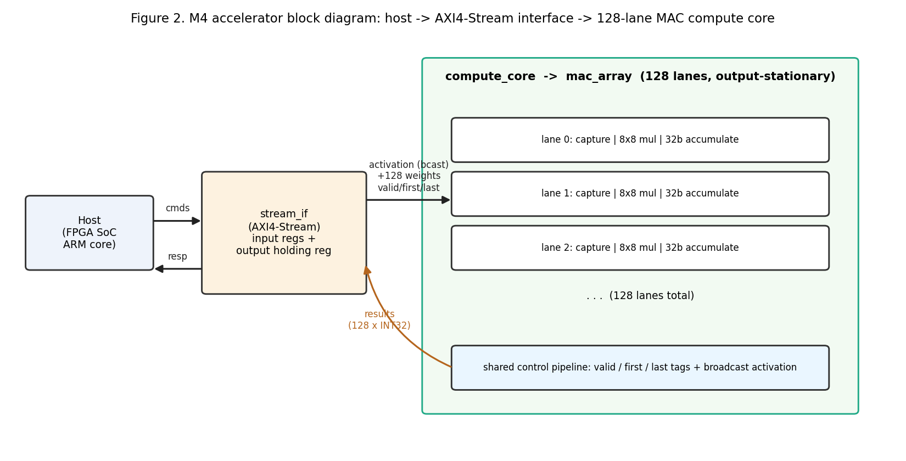

# 1. Problem and motivation

This project accelerates the multiply-accumulate reduction at the center of a
representative 3x3 INT8 convolution from YOLO-nano. The selected layer has a
52x52x64 input, 128 output channels, and a reduction length of
3x3x64 = 576 per output pixel and channel: 199,360,512 MACs
(398,721,024 FLOPs).

In M1 profiling, `conv3x3_int8_vectorized` consumed 2.275 of 2.379 seconds
across 15 calls (95.6%). The NumPy im2col-plus-GEMM implementation ran the
layer in a median 160.9 ms at 2.478 GFLOP/s. This is the M4 comparison point.

The chiplet accelerates the reduction kernel only. A host supplies activation
elements, loads weights, accumulates returned tile partials, and handles
sliding-window generation, padding, and output conversion. This partition is
what makes the design synthesizable, interface-connected, and measurable
against the M1 baseline.

# 2. Roofline analysis

The M1 **algorithmic arithmetic intensity** counts the input feature map,
weights, and final output once:

```text
398,721,024 FLOPs / (173,056 + 73,728 + 346,112 bytes)
  = 672.497 FLOP/byte
```

At this AI the convolution is compute-bound on both the M1 Pro reference and
the originally proposed accelerator. This motivated a parallel INT8 MAC array:
at this intensity, multiplier count is the lever, not external bandwidth.

The implemented chiplet does not achieve ideal reuse. Weight banks hold 64
entries per lane, so a 576-element reduction needs nine tiles, and each tile
returns 128 INT32 channel partials over a 64-bit serialized stream. Per layer
the transaction schedule is 73,728 weight-load beats, 1,557,504 compute beats,
and 3,115,008 output beats — 37,969,920 stream bytes at 8 bytes/beat — for an
**implemented-interface arithmetic intensity of 10.501 FLOP/byte**.

The kernel is compute-bound under ideal on-chip reuse; the implemented chiplet
is serialization-bound. At the projected 114.536 MHz one 64-bit stream
direction is rated 0.916 GB/s and the schedule needs 0.889 GB/s. Figure 1
shows both AI points and the projected production point.

{width=88%}

# 3. Precision and data format

The datapath uses signed INT8 activations and weights with signed INT32
accumulation. Each INT8 multiplication produces a signed 16-bit product, which
is sign-extended before accumulation. INT32 is sufficient for a full
576-element reduction: even the conservative magnitude bound
576 x 16,384 is below 10 million, well within signed 32-bit range.

INT8 was selected for area-per-multiplier on an edge target. The precision
study ran 1,000 deterministic 576-tap reductions against an FP32 reference,
matching the full reduction reconstructed from nine hardware tiles: mean
absolute error 0.0360, RMS error 0.0448, max 0.1503, relative MAE 0.564%.
Sufficient for the reduction kernel; task-level YOLO accuracy needs a trained
quantized model and is out of scope.

Each lane represents its running partial sum in carry-save form as two 32-bit
registers. The inner loop computes a three-input XOR and a majority function
bitwise instead of propagating a carry through a 32-bit adder every cycle. A
single carry-propagate add resolves the result on the tile's `last` element.
Carry-save is bit-exact relative to ordinary INT32 addition for the tested
reductions.

# 4. Dataflow and architecture

The compute dataflow is **output-stationary and weight-streaming within each
tile**. One activation is broadcast to all 128 lanes each compute cycle. Lane
`i` receives the weight for output channel `i` and keeps that channel's partial
sum resident for the 64-element tile. At the end of the tile, all 128 channel
partials are captured for serialization. This dataflow fits convolution
reduction because all output channels consume the same activation element while
using different weights.

The `mac_array` compute engine contains 128 parallel lanes and a three-stage
pipeline: Stage A captures activation and weights, Stage B performs the signed
8x8 multiplication, and Stage C updates or resolves the carry-save
accumulator. Shared `valid`, `first`, and `last` tags travel with the data.
During a tile, the array accepts one reduction element per cycle and performs
128 useful MACs per compute cycle.

The synthesized production boundary is `accel_top`, shown in Figure 2. It adds
four necessary chiplet functions:

1. A 64-bit opcode-tagged AXI4-Stream input.
2. 128 private 64-entry-by-8-bit inferred weight banks.
3. A registered activation/control broadcast stage.
4. A result buffer and serializer that returns one channel partial per beat.

The final scope is a **64-element tiled reduction chiplet**. Nine invocations
reconstruct the full 576-element reduction; the host adds each returned INT32
partial inline as its serialized beat arrives, which the testbench models
(no extra cycles beyond the drain stream). Sliding-window generation, padding,
line buffers, and output quantization remain with the host. This is narrower
than the M1 target but is the design represented consistently across final
simulation, synthesis, and benchmark.

{width=92%}

{width=92%}

# 5. Hardware interface

The chiplet exposes 64-bit AXI4-Stream input and output (`TVALID`/`TREADY`/
`TDATA`). AXI4-Stream is a published AMBA streaming protocol that connects
naturally to host DMA or control logic on the assumed FPGA-SoC, with no
chiplet-side change.

Input opcode `0x01` loads one signed INT8 weight into a selected lane and
address. Opcode `0x02` carries a broadcast activation plus `first`/`last`
tags. The output returns a 7-bit channel index and one signed INT32 partial
per beat. The testbench drives complete weight, compute, and response
transactions exclusively through these ports.

The interface is functionally correct but is the dominant performance limit.
The serializer needs 128 output beats after every 64 compute beats, and
`accel_top` has one result buffer (input `TREADY` drops while draining), so
each tile must drain before the next can issue. The result path therefore
costs more cycles than the compute path.

M1's bandwidth conclusion assumed a full 576-entry on-chip weight store and
ideal feature-map reuse; that design would not be interface-bound. The
implemented 64-entry tiled design is, and the benchmark reports it.

# 6. Verification

The final testbench `tb/tb_top.sv` instantiates `accel_top` at the synthesized
`L_MAX=64` and drives only the production AXI4-Stream ports. It builds
deterministic signed INT8 activations and weights for eight pixels and
computes two independent references: every 64-element tile partial and every
full 576-element result. Pixel 0, channel 0 uses alternating `127`/`-128`
operands to exercise full-scale INT8 and large-magnitude carry-save
accumulation; the other vectors provide varied signed values.

For each of nine tiles the testbench loads 128 x 64 weights, streams each
pixel's 64 activation elements, receives 128 serialized channel partials, and
adds them into a host-side accumulator. It checks 9,216 tile partials and
1,024 reconstructed full results. The committed log reports:

```text
partial_errors=0 full_errors=0
total_cycles=87988
backpressure_cycles=3 backpressure_errors=0 unstalled_schedule_cycles=87985
useful_macs_per_total_cycle=6.703
PASS: final synthesized-config accel_top tiled 576-element reduction
```

The test deliberately deasserts output `TREADY` for three cycles and still
passes every ordering and value check. The 87,985-cycle unstalled schedule,
not the injected stall, is used for layer extrapolation. The 6.7 MAC/cycle
figure in this short run amortizes 73,728 weight beats over 8 pixels; the
full-layer benchmark amortizes them over 2,704. The test validates the four
cycle categories the benchmark extrapolates from: weight loads, compute beats,
serialized drains, and protocol gaps. Figure 4 shows a compute tile entering
the array and its partial result entering the serializer.

{width=95%}

# 7. Synthesis results

Synthesis: OpenLane 2 v2.3.10, sky130A / `sky130_fd_sc_hd`. The final
configuration `synth/config.json` is `accel_top`, 128 lanes, `L_MAX=64`,
6.0 ns target, 3.3 mm x 3.3 mm die.

The wrapper completed synthesis, floorplanning, placement, CTS, post-CTS
timing repair, and global routing. The deepest snapshot contains 558,792
standard cells and 5.015 mm^2 of cell area. Dominant contributors: inferred
weight-register banks, 128 multipliers and carry-save accumulators, clock
tree, timing-repair buffers. The 65,536 weight bits alone account for at
least 77.17% of the design's 84,927 sequential cells; the 70,646
timing-repair buffers are 12.64% of all post-CTS cells. Global routing
reached zero overflow on every metal layer.

At the post-CTS typical corner, the 6.0 ns target has setup WNS -2.730896 ns
— a setup-limited projected period of 8.730896 ns, or **114.536 MHz**. The
same snapshot has -1.852060 ns hold WNS and 32,070 reported hold violations,
but register-to-register hold worst slack is +0.197419 ns with zero
violations. There are two max-slew and one max-capacitance violations.
Detailed routing and final timing repair did not complete, so these are
unresolved; 114.536 MHz is a setup-limited estimate, not sign-off, and no
slow-corner wrapper frequency is claimed.

The worst setup path starts at a result-path flip-flop, runs through fanout
buffers and serializer mux/output logic, and ends at `m_tdata[26]` (-2.730896
ns slack). The interface, not the per-lane multiplier, is the wrapper timing
limiter. The run used OpenLane's generic fallback SDC because no
`PNR_SDC_FILE` or `SIGNOFF_SDC_FILE` was supplied. A follow-on run needs an
explicit host-interface SDC, completed detailed routing, and rerun setup/hold
repair before interface timing closure is claimed.

Post-CTS power estimate: **1.018 W** at the typical corner with default
switching activity, dominated by sequential logic and clock distribution.
Pre-detailed-route and not workload-annotated. Analyzed at the 6.0 ns target
rather than the slower setup-limited frequency. Used as an approximate energy
result only.

# 8. Benchmark results

The final benchmark derives full-layer cycles from the transaction schedule
measured by `tb_top.sv`. One layer requires:

```text
73,728 weight-load cycles
1,557,504 compute-input cycles
3,115,008 serialized-output cycles
146,017 pipeline and protocol-gap cycles
= 4,892,257 total cycles
```

**40.750 useful MACs per total chiplet cycle**. At the projected 114.536 MHz
this is 42.714 ms and **9.335 GFLOP/s** — a **3.77x projected speedup** over
the M1 median (160.9 ms, 2.478 GFLOP/s) for the same FLOP count. M1 includes
im2col/padding/output and M4 excludes host orchestration; the wrapper does
not close timing. So this is a chiplet-schedule projection, not a
demonstrated end-to-end operating point.

Power estimate x projected runtime gives 43.483 mJ/layer and 9.17 GFLOP/s/W.
Arithmetic estimate only. The M1 Pro package power was not measured during
the M1 runs, so the software-side energy is estimated from published M1 Pro
power figures. Apple's M1 Pro performance-per-watt positioning and
independent reviews (AnandTech, October 2021) report sustained CPU package
power around 30 W under heavy multi-core load. The NumPy baseline runs
effectively single-threaded at 1.2% of peak, so a realistic single-core
attribution is closer to 10 W. Both brackets versus the chiplet's 43.483
mJ/layer:

```text
upper bound: 30 W x 160.9 ms = 4,827 mJ -> ~111x energy ratio
realistic:   10 W x 160.9 ms = 1,609 mJ ->  ~37x energy ratio
```

Neither value is measured wall-plug energy; both are arithmetic estimates
from published CPU power figures and the post-CTS HW estimate. The
breakdown is in `bench/benchmark.md` and the raw inputs are in
`raw_measurements.csv`.

M1 targeted 64 GFLOP/s at 250 MHz. The gap is the lower wrapper frequency
projection, nine-way tiling forced by 64-entry weight banks, and serialized
tile-partial output. Figure 1 reflects these.

# 9. What did not work

The first major failure was scope: a full 576-entry weight bank for every lane
was too large when inferred as flip-flops in the available educational flow.
The final synthesizable production configuration therefore uses 64 entries and
host-managed tiling. A better implementation would integrate SRAM macros so
the complete 576-element weights remain on chip.

The second failure was treating the compute-array rate as accelerator
throughput. The wide unit-test wrapper and the inner compute phase can sustain
nearly 128 MACs/cycle, but the production wrapper must serialize 128 channel
partials and has only one result buffer. When the final testbench was changed
to 64-tap tiles, issuing pixels without waiting for serialization overwrote the
result buffer. The corrected host protocol waits for each result drain, and the
benchmark includes that cost. A next version should use double buffering, a
FIFO, or a wider output stream to overlap compute and drain.

The attempted eight-bank broadcast optimization also did not work as intended.
`accel_top` creates eight registered activation/control copies, but `mac_array`
exposes only one scalar shared activation/control input, so only bank 0 is
connected and the unused copies are eligible for synthesis removal. The final
design therefore has registered broadcast staging, not a true eight-bank
fan-out tree. A real banking fix requires splitting `mac_array` into banked
instances or changing its interface so each lane group consumes its own
registered copy.

The third major failure was timing closure. In the separate routed-lane
experiment, carry-save accumulation moved the critical path away from the
32-bit accumulation adder and exposed the 8x8 signed multiplier as the new lane
limiter. The full wrapper was slower still because of its weight storage,
shared broadcast network, clock distribution, and routing. It also retains
unresolved non-register-to-register hold, slew, and capacitance violations at
the final snapshot. Pipelining the multiplier would improve the lane, while
completed timing repair and hierarchical physical design would better address
the full array. I would also provide an explicit
host-interface SDC instead of the generic fallback so input/output timing and
the serializer critical path are constrained against the assumed FPGA-SoC.

The fourth failure was full detailed routing. The bare array first failed
because exposing all wide weights and results created 5,134 top-level pins.
`accel_top` reduced that to 137 pins and completed global routing with zero
overflow, but TritonRoute failed during detailed-routing track assignment on
the available 16 GB host. The committed `openlane_run.log` records this failure,
and the report uses only the deepest available full-wrapper post-CTS results.

Finally, power estimation is not workload-annotated. The 1.018 W result uses
default activity and lacks final routed parasitics. A stronger follow-on would
complete detailed routing and replay the production testbench with VCD or SAIF
activity.

The design is narrower and slower than M1's target but is coherent: the same
64-tap chiplet is verified, synthesized, analyzed, and benchmarked, and
reconstructs the 576-element reduction. The projected kernel advantage is
real; timing closure and an end-to-end host benchmark would be needed to call
it demonstrated.
